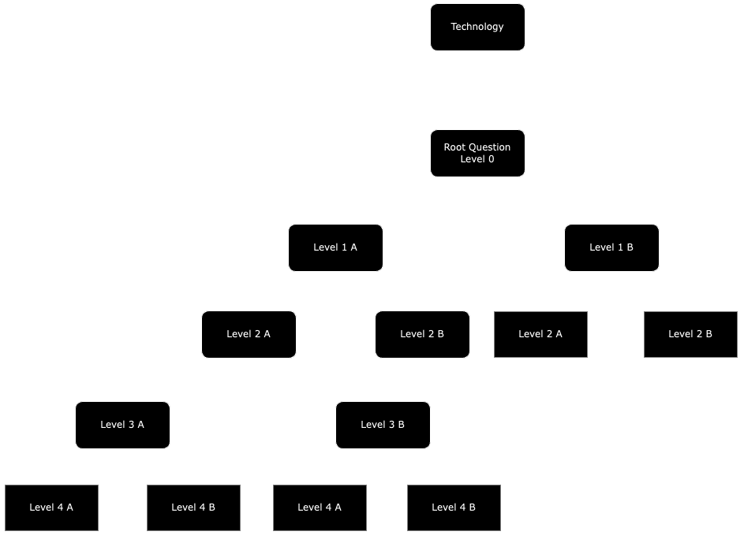
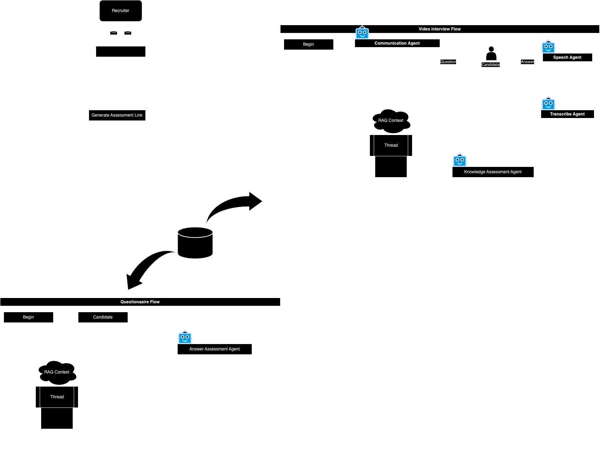

# AI Video Interview and Assessment System

This project is an AI-driven interview assessment platform designed for recruiters to evaluate candidates' skills comprehensively. It features video-based assessments, dynamically generated questionnaires, and technology-focused question trees to gain insights into each candidate’s skill level and suitability for specific roles.

## Table of Contents

- [Project Overview](#project-overview)
- [System Components](#system-components)
- [Assessment Flow](#assessment-flow)
- [Database Schema](#database-schema)
- [Technology Question Tree](#technology-question-tree)
- [Setup and Installation](#setup-and-installation)
- [Usage](#usage)
- [Future Enhancements](#future-enhancements)

## Project Overview

This AI system enables recruiters to conduct video interviews and questionnaires to evaluate candidates. Using a multi-agent architecture, the system assesses candidates based on role-specific requirements and competencies derived from job descriptions, resumes, and recruiter inputs. The project combines a relational database for structured data management and a graph database for dynamically branching question trees that evaluate technical knowledge in-depth.

## System Components

### 1. Rec Agent
- **Role:** Suggests relevant skills and priority levels for evaluation based on the job description and candidate resume.
- **Flow:** Integrates with ATS software to parse the resume and job details, creating a **RAG (Retrieve-Augment-Generate) Context** for agents to work from.

### 2. RAG Context
- **Purpose:** Serves as the initial context containing candidate information such as their resume, job role, skill requirements, and recruiter notes.
- **Diagram:** [Assessment Flow](diagrams/assessment_flow.drawio.png)

### 3. Graph Database
- **Purpose:** Stores specialized question trees for each technology (e.g., Kubernetes, Docker). These trees enable
-  agents to ask progressively challenging questions based on the candidate's responses.
- **Example:** [Kubernetes Question Tree](diagrams/example_tree_kubernetes.drawio.png)
  

### 4. Multi-Agent System
- **Communication Agent:** Conducts the interview by asking relevant questions.
- **Voice Transcription Agent:** Transcribes candidate responses for further analysis.
- **Knowledge Assessment Agent:** Evaluates knowledge depth by analyzing transcriptions against required skills.
- **Speech Agent:** Analyzes articulation, confidence, and overall clarity.
- **Role Agent:** Aggregates scores to determine candidate suitability based on the required skills for the role.

## Assessment Flow

The assessment can proceed in two primary ways: via video interviews or questionnaires. Each path evaluates the candidate through distinct mechanisms (e.g., voice analysis vs. written response analysis).

1. **Recruiter Workflow**
    - Recruiters upload candidate resumes and job descriptions.
    - They define required skills, priority levels, and add notes if necessary.

2. **Initialization of RAG Context**
    - The context for the agents is created based on resume, job description, skills, and other details provided by the
 recruiter.
    - Initial level on each tree is assigned based on connection from resume to job description.
    - Agents are initialized with prompts and context information for the candidate.

3. **Video Interview**
    - Agents conduct and analyze video interviews, assessing both content and delivery, with the goal of creating a 
    - role_suitability score for the candidate.

4. **Questionnaire**
    - The system dynamically adjusts question difficulty based on previous responses, continuing until enough data 
   is collected.
    - A role_suitability_score is created based on results



## Database Schema

The relational database is structured to manage interconnected entities like recruiters, candidates, companies, roles, and assessments. Each assessment includes a dynamic JSON field to accommodate variable skill requirements for each role.


- **Recruiter Table:** Contains recruiter information, including associated companies and candidates.
- **Candidate Table:** Stores candidate information and links to accounts, resumes, and repositories.
- **Company & Role Tables:** Define roles within companies, which contain specific skills and assessments.
- **Assessment Table:** Uses a dynamic JSON field for each skill's details, priority, and additional requirements.

## Technology Question Tree

Each technology (e.g., Kubernetes, Docker) has a separate question tree stored in a graph database. This tree allows agents to ask progressively more challenging questions to gauge a candidate’s expertise in specific technologies.


- **Root Question:** Basic introductory question on the technology.
- **Branching Questions:** Each level of the tree has two branches:
    - One that builds on the previous question’s topic.
    - Another that explores a related but distinct concept.
- **Progression:** As the agent traverses the tree, questions become broader and more challenging, enabling deeper insights into the candidate's knowledge.

### Why Use a Question Tree?

The question tree helps the system assess the candidate’s understanding by adapting question complexity based on the 
candidate's previous answers, thus making the evaluation process more nuanced and personalized.

## Setup and Installation

1. **Clone the Repository**
   ```bash
   git clone <repo-url>
   cd <repo-folder>
